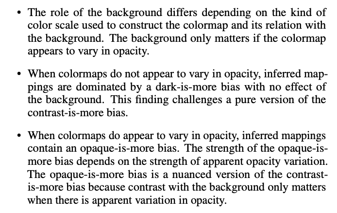

"Mapping Color to Meaning in Colormap Data Visualizations"- https://schlosslab.discovery.wisc.edu/wp-content/uploads/2018/09/SchlossGramazioSilvermanParkerWanginPress.pdf

This paper focuses on how differnt colors affect the way people interpret colormaps. they argue that when a person reads a colormap such as weather maps, neural activity maps and so on, they have to form conceptual inferences from what they see. In order to test how people formed these inferences, they created a test where they used different color backgrounds. Finding the following assumptions:

They designed two experiments to analize their hypothesis:

1. In experiment 1 they evaluated how the background color influenced
  inferred mappings when colormaps were constructed using various
  standard color scales for visualization.
  
2. Experiment 2 directly tested our hypothesis that there is an opaque-ismore bias.

They concluded that, if the opacity is consistent then there is no effect on bias caused by the background color, but if the opacity does change on the color map, then there is a relationship between opacity, bias and background color. 
