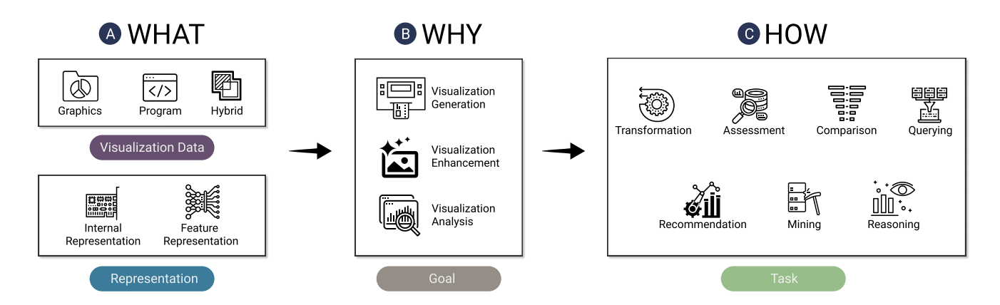

https://ieeexplore.ieee.org/stamp/stamp.jsp?tp=&arnumber=9495259

In this weeks data viz, the researchers argue that data visualizations have become a data format that is heavily shared and reused. 
They are planing to use AI to approach this. 

There are three areas of focus that using AI can help on: Generation, Enhancement and Analisys

